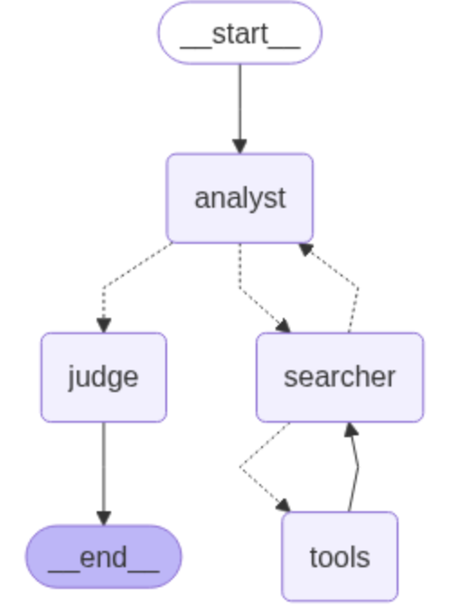

# Sample Generative / Agentic AI App


This app provides an extensible blueprint for creating simple GenAI and/or Agentic AI demos with Streamlit on Openshift AI.

It consists of the following tabs:

* Chatbot (GenAI)
Simple virtual assistant; potential demos include
	* Question answering
	* Machine translation

* Analyzer Agent (Agentic AI)
Simple agentic app template for demonstrating text mining use cases; potential demos include
	* <a href="#">Log analysis (current)</a>
	* <a href="https://github.com/agapebondservant/salesforce_poc_app.git" target="_blank">Service ticket automation / routing</a>
	* Fraud detection
	* Survey analysis
	* Topic modeling
	* Sentiment analysis
	* Customer feedback analysis
	* Code refactoring analysis
	* etc.

# Customizing the App



To customize the app template for your own use case:
* Review the workflow above (you may also view the notebook <a href="https://github.com/agapebondservant/instruct-lab-pocs/blob/main/notebooks/log_analyzer.ipynb" target="_blank">here</a>)
* Update the prompt templates in `templateprompts.py`:
	* `analyst_template` provides comprehensive analysis of the uploaded file
	* `searcher_template` searches the web for revelant links to include in the final result
	* `judge_template` provides a final classification / routing decision based on the analyzer's feedback
* Give your app a name: `APP_NAME=<fill in the name of your app>`
* Update the `APP_DESCRIPTION` in the .env file as appropriate
* (Any other desired updates)

# Deploying / Running

To run the app locally:
  1. Create an .env file with necessary environment variables for the app - use `.env-template` as a base template
  2. Set up a virtual environment: `python3 -m venv venv` (tested with python 3.11, 3.12)
  3. Activate the virtual environment: `source venv/bin/activate`
  4. Install Rust: `curl --proto '=https' --tlsv1.2 -sSf https://sh.rustup.rs | sh`
  5. Install dependencies: `pip install -r requirements.txt`
  6. Start the app: `python3 -m streamlit run app.py`
  
To run the app on Openshift:
  1. Create an .env file with necessary environment variables for the app - use `.env-template` as a base template
  2. Run the following script:

  ```
  APP_NAME=<fill in the name of your app>
  oc new-build --binary --strategy=docker --name $APP_NAME
  oc start-build $APP_NAME --from-dir . --follow
  oc new-app -i $APP_NAME:latest --env-file .env
  oc expose deploy $APP_NAME --port 8501
  oc expose svc $APP_NAME
  ```
  3. The app should be accessible at the FQDN below:
  
  ```
  echo http://$(oc get route -o json | jq -r '.items[0].spec.host')
  ```
  4. Troubleshooting:
  
  ```
  oc logs $(oc get pod -o name -l deployment=$APP_NAME)
  ```

For demonstrations:
1. Should support any type of logfile. For demonstration purposes, try to stick to smaller files. See the `sample_logs` directory for a good sample set for demos.

OTHER NOTES:
* Tested with python 3.11, 3.12
